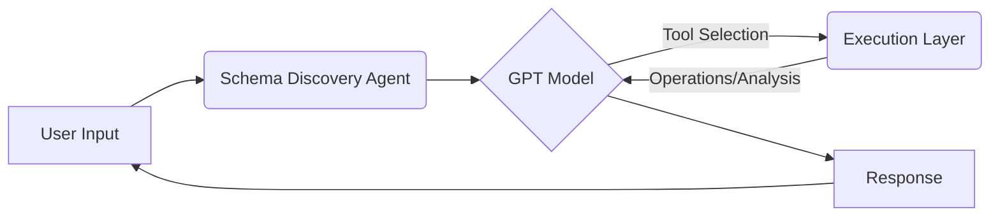

Yes, absolutely! To make the documentation even more comprehensive, let's add more sections. Here are some areas we can expand upon to provide richer documentation:

Let's add these new sections to the concise documentation we created earlier.

Here's the expanded documentation with added sections:

# Agents Architecture: Comprehensive Documentation

## Overview

The Agents system is a data analysis and schema discovery framework using OpenAI's GPT models. It analyzes data files, infers schemas, and performs data manipulations. Key principles are modularity, flexibility, scalability for large files, and intelligent automation using LLMs.

## Architecture

Three core components:

1.  **Schema Discovery Agent (`schemaAgent.ts`):** Orchestrates the workflow, manages conversations with GPT, executes tools, and handles errors.
2.  **Execution Layer (`execute.ts`):** Provides file operations (listing files, getting size, reading content) and analysis functions (schema understanding, content analysis, data merging).
3.  **Tools Configuration (`tools.ts`):** Defines available tools (functions) for the GPT model to use.

**Simplified Data Flow:** User Input -> Agent -> GPT (Tool Selection) -> Execution Layer -> GPT (Response) -> User.



## Core Components (Key Points)

### 1. Schema Discovery Agent (`schemaAgent.ts`)

*   **Orchestrator:** Manages user interaction, GPT, and tools.
*   **`systemMessage`:**  Defines agent behavior (role as schema discovery agent, process, available tools).
*   **`runSchemaDiscoveryAgent`:**  Main function driving the agent's workflow:
    *   Receives user input.
    *   Interacts with GPT (chooses tools).
    *   Executes tools from `execute.ts`.
    *   Handles errors and returns responses.

### 2. Execution Layer (`execute.ts`)

Provides functions for:

*   **File Operations:**
    *   `get_files_list()`: Lists files in a directory.
    *   `get_file_size()`: Gets file size.
    *   `get_file_content_low_level()`: Reads file content in chunks (bytes/lines).
*   **Analysis Functions:**
    *   `understand_schema()`: Infers schema using GPT.
    *   `analyze_file_content()`: Deep analysis using schema and GPT.
    *   `display_file_content()`: Shows content, highlights data points.
    *   `merge_data()`: Intelligent data merging using GPT.

### 3. Tools Configuration (`tools.ts`)

*   Defines tools as OpenAI `ChatCompletionTool` objects.
*   Each tool specifies: `name`, `description`, `parameters`.
*   Tools include: `get_files_list`, `get_file_size`, `get_file_content_low_level`, `understand_schema`, `analyze_file_content`, `display_file_content`, `merge_data`, `ask_human`.
*   Descriptions guide GPT tool selection.

## Data Flow (Simplified)

1.  **User Input:** User request.
2.  **Agent & GPT:** Agent processes input via GPT, GPT selects tools.
3.  **Tool Execution:** Agent executes selected tool from `execute.ts`.
4.  **Content Processing:** `execute.ts` functions handle file operations and analysis.
5.  **Response:** GPT generates a response based on tool results, returned to user.

## Code Structure (Files)

*   **`schemaAgent.ts`**: Agent logic, `runSchemaDiscoveryAgent`, `systemMessage`.
*   **`execute.ts`**: File operations and analysis functions.
*   **`tools.ts`**: Tool definitions for GPT function calling.
*   **`sample_files/`**: Example data files (XML, JSON, CSV).

## Getting Started: Installation and Setup

To run the Agents system, follow these steps:

1.  **Prerequisites:**
    *   **Node.js and npm (or yarn/pnpm):** Ensure you have Node.js installed (version 18 or higher recommended). npm usually comes with Node.js.
    *   **OpenAI API Key:** You will need an OpenAI API key to use the GPT models. You can obtain one from the [OpenAI website](https://platform.openai.com/).

2.  **Clone the Repository:**
    ```bash
    git clone [repository-url]
    cd [repository-directory]
    ```
    *(Replace `[repository-url]` and `[repository-directory]` with your actual repository details)*

3.  **Install Dependencies:**
    ```bash
    npm install  # or yarn install or pnpm install
    ```
    This command installs all necessary packages listed in `package.json`, including the `openai` library.

4.  **Set up Environment Variables:**
    *   Create a `.env` file in the project root directory.
    *   Add your OpenAI API key to the `.env` file:
        ```
        OPENAI_API_KEY=YOUR_OPENAI_API_KEY_HERE
        ```
        *(Replace `YOUR_OPENAI_API_KEY_HERE` with your actual API key)*

5.  **Run the Agent (Example):**
    You can run a basic example by executing `schemaAgent.ts` directly (you might need to adapt the example usage code to be directly runnable as a script, or create a separate script).  For instance, if you have a `main()` function in `schemaAgent.ts` as shown in the usage example:

    ```bash
    npx tsx ./schemaAgent.ts
    ```
    *(You might need to install `tsx` globally or locally if you don't have it: `npm install -g tsx` or `npm install tsx`)*

## Usage Examples

Here are more detailed usage examples to illustrate how to interact with the Agents system.

### Example 1: Listing Files in the Sample Directory

```typescript
import OpenAI from 'openai';
import { runSchemaDiscoveryAgent, systemMessage } from './schemaAgent';

const openai = new OpenAI({ apiKey: process.env.OPENAI_API_KEY }); // Ensure API key is set in .env
const messages = [{ role: "system", content: systemMessage }];

async function main() {
    const userInput = "What files are in the sample files directory?";
    const response = await runSchemaDiscoveryAgent(userInput, openai, messages, (stepInfo) => console.log(stepInfo));

    if (response) {
        console.log("\nAgent Response:\n", response);
    } else {
        console.log("\nAgent did not return a final response.");
    }
}
main();
```

**Expected Output:** The agent should use the `get_files_list` tool and respond with a list of files found in the `sample_files` directory, like:

```
Agent Response:
 Here are the files I found in the sample_files directory:
- orders.xml (xml)
- products.json (json)
- sales_data.csv (csv)
- transactions.csv (csv)
- users.json (json)
```

### Example 2: Analyzing the Schema of `products.json`

```typescript
import OpenAI from 'openai';
import { runSchemaDiscoveryAgent, systemMessage } from './schemaAgent';
import fs from 'fs/promises';
import path from 'path';

const openai = new OpenAI({ apiKey: process.env.OPENAI_API_KEY });
const messages = [{ role: "system", content: systemMessage }];

async function main() {
    const filename = 'products.json';
    const filePath = path.join('app/agents/sample_files', filename); // Adjust path if needed
    const fileContent = await fs.readFile(filePath, 'utf-8');

    const userInput = `Analyze the schema of the file ${filename}. Here is the content: ${fileContent}`;
    const response = await runSchemaDiscoveryAgent(userInput, openai, messages, (stepInfo) => console.log(stepInfo));

    if (response) {
        console.log("\nAgent Response:\n", response);
    } else {
        console.log("\nAgent did not return a final response.");
    }
}
main();
```

**Expected Output:** The agent should:

1.  Recognize the user wants to analyze a file.
2.  Use the `understand_schema` tool with the content of `products.json` and `file_type: "json"`.
3.  Respond with a schema analysis of the `products.json` file, describing its structure (e.g., it's an array of product objects, each with fields like `id`, `name`, `description`, `price`, `category`).

### Example 3: Merging `users.json` and `orders.xml` (Illustrative - May Require Further Refinement)

```typescript
import OpenAI from 'openai';
import { runSchemaDiscoveryAgent, systemMessage } from './schemaAgent';
import fs from 'fs/promises';
import path from 'path';

const openai = new OpenAI({ apiKey: process.env.OPENAI_API_KEY });
const messages = [{ role: "system", content: systemMessage }];

async function main() {
    const file1Name = 'users.json';
    const file2Name = 'orders.xml';

    const file1Path = path.join('app/agents/sample_files', file1Name);
    const file2Path = path.join('app/agents/sample_files', file2Name);

    const file1Content = await fs.readFile(file1Path, 'utf-8');
    const file2Content = await fs.readFile(file2Path, 'utf-8');

    const userInput = `Merge the data from ${file1Name} and ${file2Name}.`;
    const response = await runSchemaDiscoveryAgent(userInput, openai, messages, (stepInfo) => console.log(stepInfo));

    if (response) {
        console.log("\nAgent Response:\n", response);
    } else {
        console.log("\nAgent did not return a final response.");
    }
}
main();
```

**Expected Output:** The agent should:

1.  Recognize the user wants to merge data.
2.  Use `understand_schema` on both `users.json` and `orders.xml` to get their schemas.
3.  Use `get_file_content_low_level` to get content snippets (or full content, depending on implementation) for both files.
4.  Use the `merge_data` tool, providing filenames, schemas, and content.
5.  Respond with either:
    *   A merged data structure (likely in JSON format), if a merge is deemed possible.
    *   An explanation of why the files cannot be meaningfully merged.

*(Note: Data merging is a complex task, and the agent's success will depend on the schemas and content of the files. This example is illustrative and might require further refinement of the `merge_data` tool and prompts to achieve optimal results.)*

## Configuration Options

Currently, the primary configuration option is setting the `OPENAI_API_KEY` environment variable. However, potential future configuration options could include:

*   **Model Selection:**  Allow users to choose different GPT models (e.g., `gpt-4`, `gpt-3.5-turbo`) by setting an environment variable or a configuration file.  *(Currently hardcoded to `gpt-4o` in `schemaAgent.ts` and `execute.ts`)*.
*   **Temperature and other OpenAI Parameters:**  Expose OpenAI API parameters like `temperature`, `top_p`, etc., to control the creativity and determinism of the GPT model's responses.
*   **Chunk Sizes for File Reading:**  For very large files, the chunk sizes used in `get_file_content_low_level` and analysis functions could be configurable to optimize performance and memory usage.
*   **System Message Customization:** Allow users to modify the `systemMessage` to tailor the agent's behavior for specific tasks or domains. This could be done via a configuration file or environment variable.
*   **Tool Set Extension:**  Provide a mechanism to easily add or remove tools available to the agent, potentially through a configuration file that lists enabled/disabled tools or allows registration of new tool definitions.

These options would enhance the flexibility and adaptability of the Agents system.

## Error Handling and Troubleshooting

The Agents system includes error handling to gracefully manage issues during tool execution and OpenAI API interactions.

*   **Tool Execution Errors:** If a tool function in `execute.ts` throws an error, it is caught in `schemaAgent.ts`. The error message and (if available) stack trace are logged and passed back to the GPT model as a tool response with a `"tool_error"` role. This allows the GPT model to be aware of the error and potentially respond to the user or adjust its strategy.
*   **OpenAI API Errors:** Errors during calls to the OpenAI API (e.g., API key issues, rate limits, network problems) are also caught in `schemaAgent.ts`. These errors are logged, and the `runSchemaDiscoveryAgent` function returns `null`, indicating a failure.
*   **Informative Logging:**  The code includes `console.log` statements throughout `schemaAgent.ts` and `execute.ts` to provide step-by-step information about the agent's process, tool calls, and results.  This logging is helpful for debugging and understanding the agent's behavior.
*   **User Feedback:** In error scenarios, the agent (via GPT's response) should ideally provide informative feedback to the user, explaining what went wrong and potentially suggesting corrective actions (e.g., "File not found", "Invalid file format", "Merging not possible due to incompatible schemas").

**Troubleshooting Tips:**

*   **Check API Key:** Ensure your `OPENAI_API_KEY` is correctly set in the `.env` file and is valid.
*   **Review Logs:** Examine the console output for error messages or unusual behavior. The step-by-step logging can be very helpful.
*   **File Paths:** Verify that file paths used by the agent are correct and that the agent has read access to the sample files directory.
*   **Tool Parameters:** If tool execution errors occur, double-check the parameters passed to the tools by the GPT model (logged in the console). Ensure they are of the correct type and format.
*   **GPT Model Behavior:**  If the agent is not behaving as expected, review the `systemMessage` in `schemaAgent.ts`.  Ensure it clearly instructs the GPT model on its role, process, and available tools. You might need to refine the `systemMessage` to better guide the GPT model.
*   **Rate Limits:** If you encounter OpenAI API rate limit errors, you may need to adjust your usage or consider requesting a rate limit increase from OpenAI.

## Extensibility and Customization

The Agents system is designed to be extensible and customizable. Here are ways to expand its capabilities:

*   **Adding New Tools:**
    1.  **Implement a new function in `execute.ts`:**  Create a TypeScript function that performs the desired action (e.g., a new data analysis technique, interaction with another API, more file manipulation operations).
    2.  **Define a Tool in `tools.ts`:** Add a new `ChatCompletionTool` object to the `tools` array. This definition should include:
        *   `name`:  A unique name for your tool (same as the function name in `execute.ts`).
        *   `description`: A clear and concise description of what the tool does.
        *   `parameters`: Define the parameters the tool accepts, including types and descriptions, following the OpenAI function calling schema.
    3.  **Update `systemMessage` (Optional but Recommended):**  Modify the `systemMessage` in `schemaAgent.ts` to inform the GPT model about the new tool and when it should be used.  Good descriptions in `tools.ts` are often sufficient, but explicitly mentioning the new tool in the system message can improve performance and guide the model more directly.
    4.  **Test the New Tool:**  Create usage examples and test the agent to ensure the new tool is correctly integrated and functions as expected.

*   **Modifying Agent Behavior:**
    *   **Adjust `systemMessage`:** The most direct way to change the agent's behavior is to modify the `systemMessage` in `schemaAgent.ts`. Experiment with different instructions, prompts, and process descriptions to guide the GPT model to act in the desired way.
    *   **Customize Tool Logic in `execute.ts`:** Modify the implementation of existing tool functions or create more specialized versions to fine-tune how data is processed and analyzed.
    *   **Implement Custom Error Handling:**  Extend or modify the error handling logic in `schemaAgent.ts` to handle specific error conditions or implement custom error reporting mechanisms.

*   **Integrating with Other Systems:**
    *   **Add Tools for External APIs:** Create new tools in `tools.ts` and corresponding functions in `execute.ts` that interact with external APIs (e.g., databases, web services, other data sources).
    *   **Modify Data Input/Output:** Adapt the agent to handle data from different sources (e.g., user uploads, databases) or output results in different formats (e.g., saving to files, sending data to other applications).

## Limitations

While the Agents system provides powerful data analysis and schema discovery capabilities, it has certain limitations:

*   **Dependency on OpenAI API:** The system heavily relies on the OpenAI API and its GPT models. Availability, performance, and cost are dependent on the OpenAI service.
*   **Complexity of Data Merging:**  Intelligent data merging is a challenging task. The `merge_data` tool relies on GPT-4's understanding of schemas and content, but the success of merging complex and semantically different datasets is not guaranteed. The quality of merge results depends significantly on the clarity and compatibility of the input data and schemas.
*   **File Size Limits:** While chunk-based reading is implemented, extremely large files might still pose performance or memory challenges, especially for analysis functions that require processing significant portions of file content.  Practical file size limits will depend on available resources and OpenAI API processing constraints.
*   **Schema Inference Accuracy:**  The `understand_schema` tool uses GPT to infer schemas, which is not always perfectly accurate, especially for very complex or unstructured data formats.  The `is_complete` flag indicates GPT's confidence in the schema, but manual verification might be necessary in some cases.
*   **Error Handling Complexity:**  While error handling is included, thoroughly handling all possible error scenarios in a complex agent system is challenging. Edge cases or unexpected tool interactions might lead to unhandled errors or less-than-ideal user experiences.
*   **Security Considerations:**  Storing and handling API keys securely is crucial. Ensure proper environment variable management and avoid hardcoding API keys in the code. Be mindful of data privacy when processing user data or sensitive files.
*   **"Ask Human" Tool Limitations:**  The `ask_human` tool provides a way for the agent to request user input, but the interaction is currently basic. More sophisticated conversational interaction patterns might require further development.
*   **Step Limit:** The current `runSchemaDiscoveryAgent` function has a step limit (`while (step < 5)`). This is for demonstration/safety and might need to be adjusted or removed for more complex or longer-running agent interactions.

Understanding these limitations is important for using and further developing the Agents system effectively.

---

This expanded documentation provides significantly more detail on setup, usage, configuration, error handling, extensibility, and limitations. It should be much more helpful for users and developers wanting to understand and work with the Agents architecture. Let me know if you have any other areas you'd like to expand upon or refine!